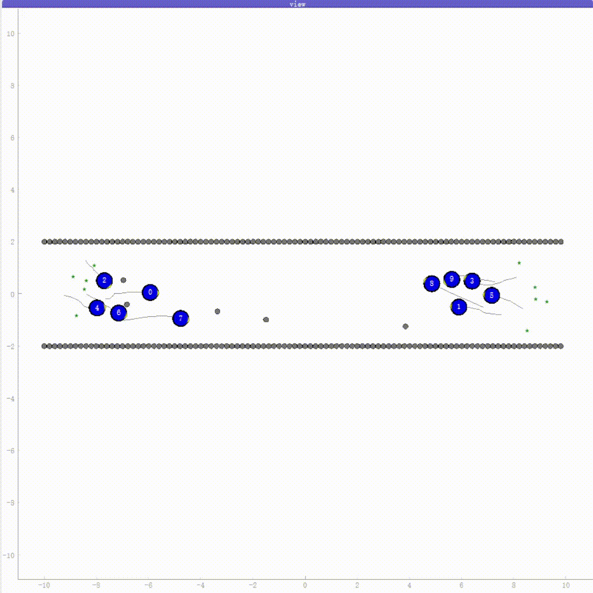
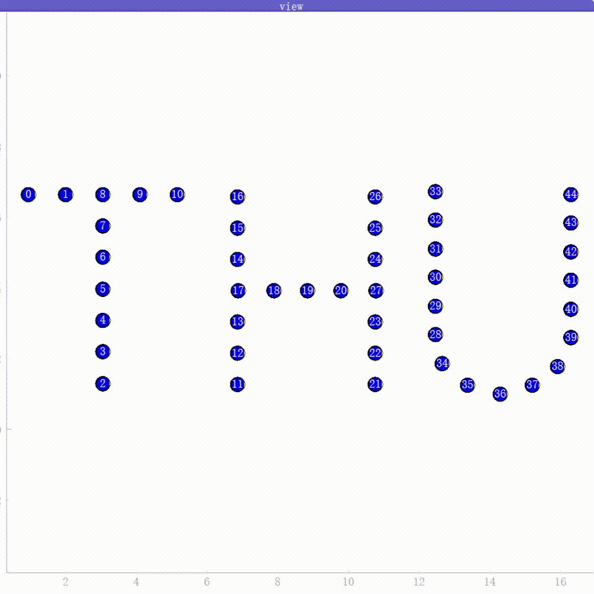
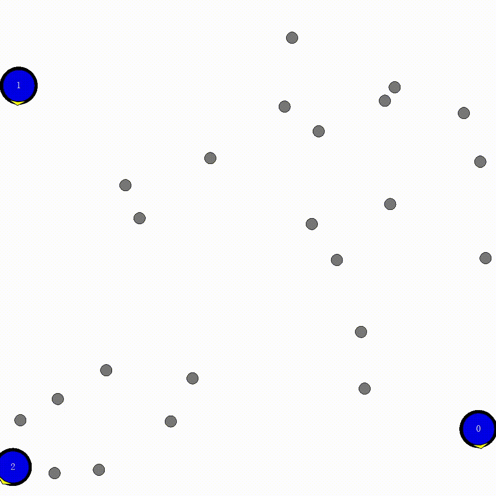
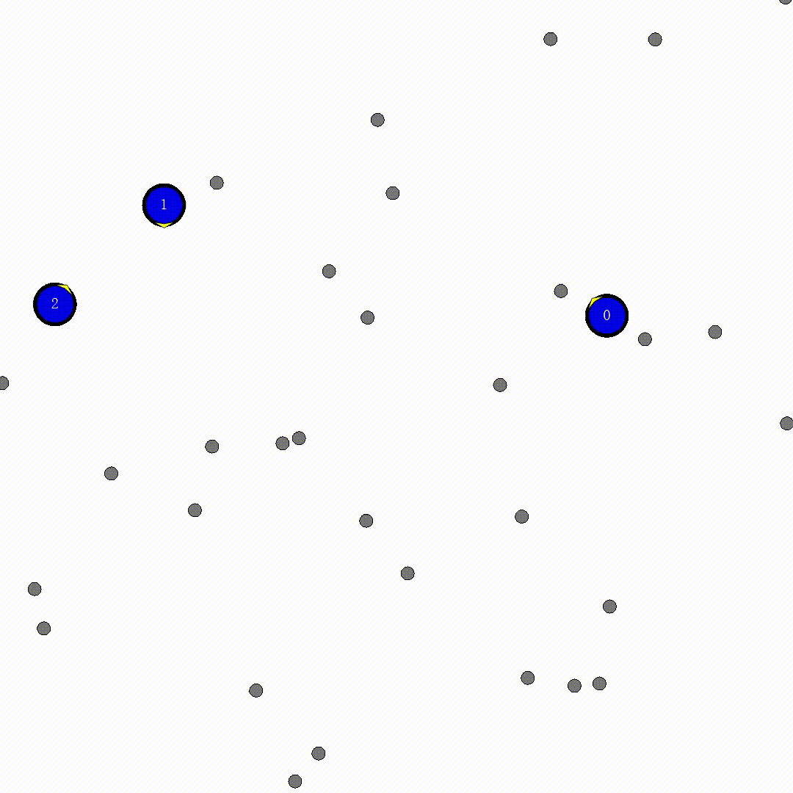
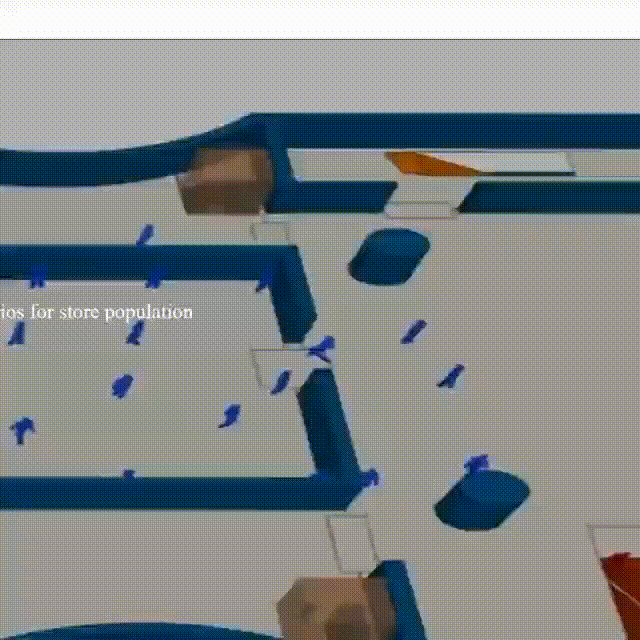
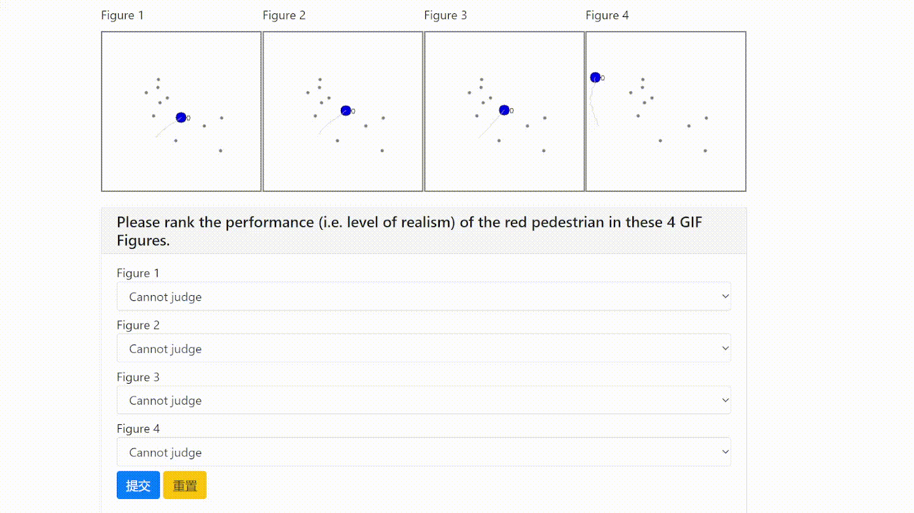

# Understanding and Modeling Collision Avoidance Behavior for Realistic Crowd Simulation

> This is a minimal realization for our work *Understanding and Modeling Collision Avoidance Behavior for Realistic Crowd Simulation*.
<!-- > For more details, contact me or see (the verbose realization)[https://github.com/yuzhTHU/RL4Pedsim] -->

1. To train an TEC-RL model, use `python train.py`. See `get_args()` in ./utils/utils.py for settable arguments.
2. To evaluate an trained model, use `python evaluate.py --LOAD_MODEL <MODEL>`.
    - We provide a demonstration model in `./checkpoint/demonstration/model_final.bin`, so you can use `python evaluation.py --LOAD_MODEL ./checkpoint/demonstration/model_final.bin` to evaluate its performance.
3. To visualize a model, use `python visualize.py --LOAD <MODEL>`. If no model is specified, the script can run normally but the agents just walk randomly.

## Demonstrations: Simulation Results

| bidirectional crowd flow | all-directional crowd flow | letter formation |
| --- | --- | --- |
| | |  |

## Demonstrations: Baselines

We present the simulation results for 3 different models as follows, each GIF containing 3 agents (blue discs) and several obstacles (gray points), using the corresponding models specified in the titles. 

| ours | SFM (Explictly-modeling Models) | PECNet (Implictly-modeling Models) |
| --- | --- | --- |
|  |  |  |

We can observe that:
- Our model (left) can maneuver flexibly to avoid other pedestrians and obstacles when moving.
- SFM (center) producing unrealistic deceleration when approaching obstacles, rather than avoid them flexibly. Since most of the commercial crowd simulators are based on SFM, they suffer from the same problem as well. Taking the [MassMotion website](https://www.arup.com/services/digital/massmotion)'s demonstration video as an example, note the pedestrian we marked with a yellow rectangle, who gets stuck in the door frame in the center of the graph. 
- PECNet (right) becomes confused after striking an obstacle, that's because its modeling does not explicitly consider collision but rather allows pedestrians to walk through obstacles and each other. Therefore, once collision is considered, PECNet (and other trajectory prediction models such as Social-LSTM, Social-GAN, and STGCNN) become confused and cannot generate natural trajectories.

## Demonstrations: Expert Ranking

Note that the ranking is to evaluate the validity of TEC metric. If the ranking result provided by experts in the video is closer to the ranking result based on TEC than based on MAE, we can say that TEC performs better than MAE in measuring the accuracy of pedestrian trajectory.

